# Estilo arquitectónico

## 1. Descripción

AyniSafe utilizará un **monolito modular** como estilo arquitectónico principal del backend.

Este estilo permite organizar las funcionalidades del sistema en módulos con responsabilidades definidas, manteniéndolos dentro de una misma aplicación backend y una unidad de despliegue.

La aplicación móvil y el panel web funcionarán como clientes independientes que se comunicarán con el backend mediante una API REST.

## 2. Estilo arquitectónico seleccionado

| Elemento | Descripción |
|---|---|
| Estilo arquitectónico | Monolito modular |
| Objetivo | Organizar las funcionalidades del backend en módulos con responsabilidades delimitadas, manteniendo una unidad principal de despliegue. |
| ¿Qué problema resuelve? | Reduce el acoplamiento entre funcionalidades y evita la complejidad de administrar múltiples servicios independientes desde las primeras etapas del proyecto. |
| Organización | Módulos de Identidad, Reportes, Análisis, Operaciones, Alertas y Consultas. |
| Comunicación externa | API REST mediante HTTPS y JSON. |
| Persistencia | PostgreSQL como base de datos principal, con acceso controlado desde los módulos correspondientes. |
| Integraciones | Servicios externos de inteligencia artificial, mapas, notificaciones y almacenamiento de evidencias. |
| Beneficios | Facilita el mantenimiento, las pruebas, el despliegue y la evolución progresiva del sistema. |

