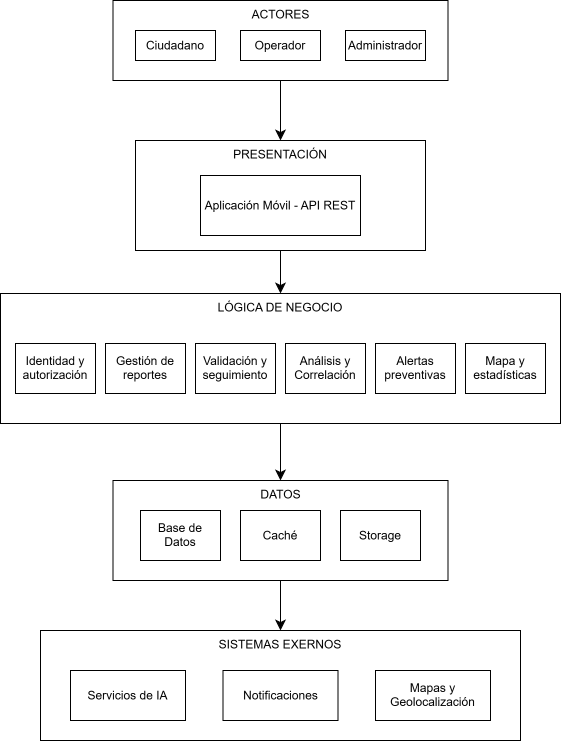

# Arquitectura inicial de AyniSafe

## Diagrama de Arquitectura

## Descripción

La arquitectura inicial de **AyniSafe** se organiza en tres capas principales:

- **Presentación:** permite la interacción de los ciudadanos mediante la aplicación móvil y de los operadores y administradores mediante el panel web. Ambas interfaces se comunican con el backend a través de una API REST.

- **Lógica de negocio:** contiene los principales módulos responsables de las funcionalidades del sistema: identidad y autorización, gestión de reportes, análisis y correlación, validación y seguimiento, alertas preventivas, mapas y estadísticas.

- **Datos:** permite almacenar y consultar la información de los usuarios e incidentes mediante PostgreSQL. Además, contempla Redis para el almacenamiento temporal en caché y Amazon S3 para las evidencias adjuntas a los reportes.

Asimismo, el sistema se integra con **servicios externos** de inteligencia artificial para el análisis de reportes, servicios de mapas y geolocalización para la visualización de incidentes y servicios de notificaciones push para distribuir alertas preventivas a los ciudadanos.

La implementación del backend se propone como **monolito modular**, con separación interna de API/controladores, aplicación, dominio e infraestructura.