# Enfoque arquitectónico

## 1. Descripción

AyniSafe utilizará **Clean Architecture (Arquitectura Limpia)** como enfoque arquitectónico para organizar las responsabilidades y dependencias internas de su backend.

Este enfoque establece que las reglas de negocio deben mantenerse independientes de los frameworks, las bases de datos, las interfaces de usuario y los servicios externos.

Su principio fundamental es que las dependencias del código deben orientarse hacia las capas internas, especialmente hacia el dominio del sistema.

## 2. Enfoque arquitectónico seleccionado

| Elemento | Descripción |
|---|---|
| Patrón / enfoque arquitectónico | Clean Architecture (Arquitectura Limpia) |
| Objetivo | Separar las responsabilidades del sistema y controlar las dependencias internas para proteger las reglas de negocio. |
| ¿Qué problema resuelve? | Evita que las reglas de negocio dependan directamente de Express, Prisma, PostgreSQL o proveedores externos de inteligencia artificial y notificaciones. |
| Capas definidas | Presentación, Aplicación, Dominio e Infraestructura. |
| Beneficios | Facilita el mantenimiento, las pruebas unitarias, la sustitución de tecnologías y la evolución de los módulos sin afectar innecesariamente las reglas de negocio. |

